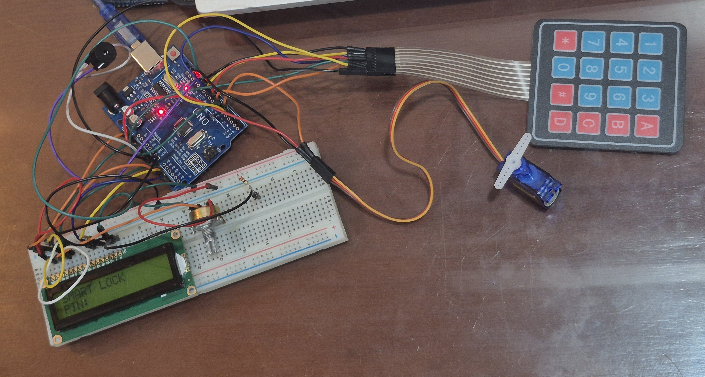
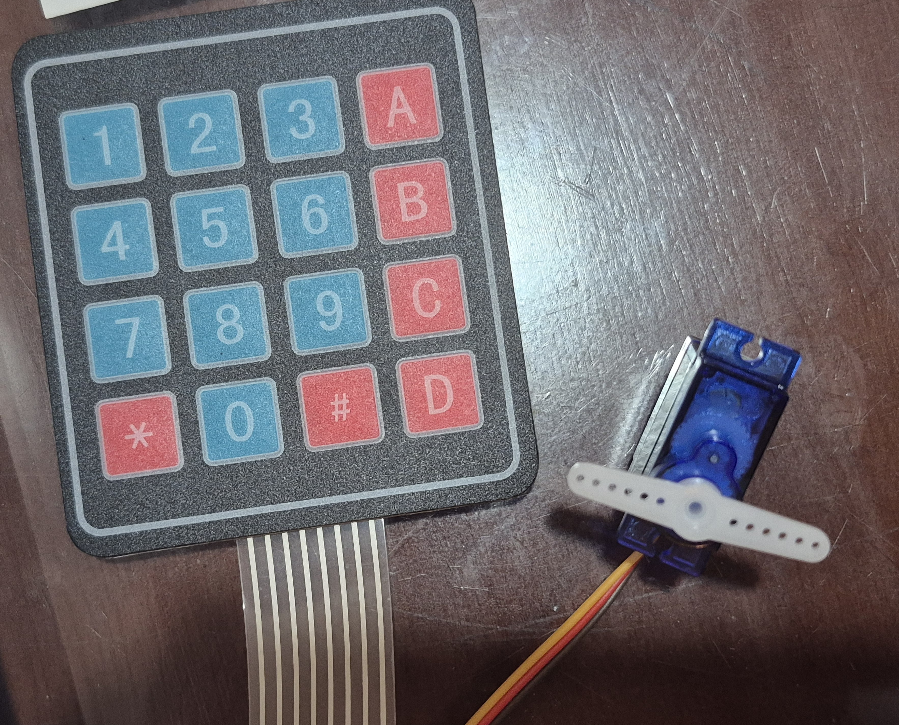
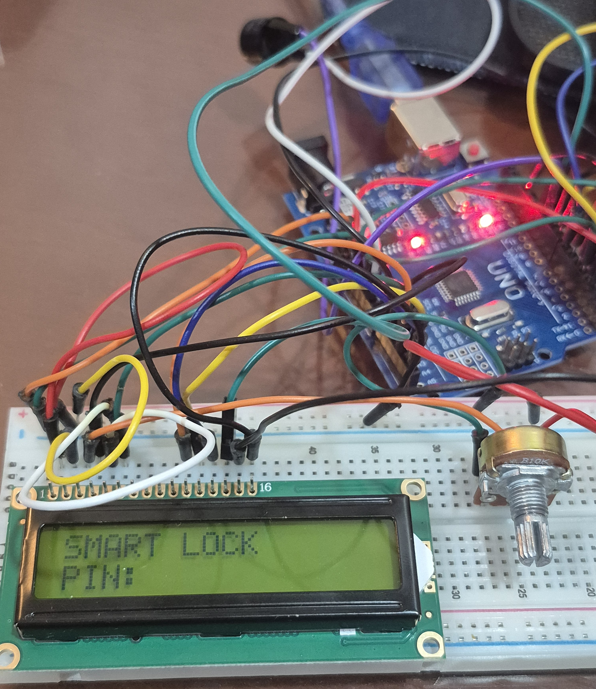
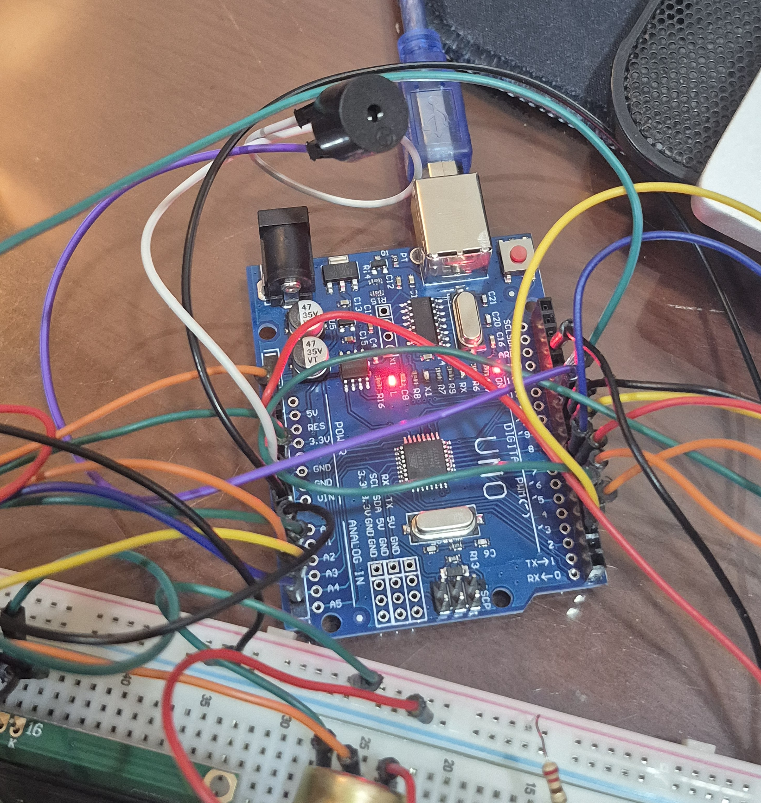

# Smart Door Lock 🔐

A password-protected smart door lock system built with Arduino Uno.

## Overview

This project simulates an electronic door lock using a 4x4 keypad, LCD1602 display, servo motor, buzzer, and EEPROM memory.

Users can unlock the door by entering the correct password and can also change the password directly from the keypad.

---

## Project Overview



### Demonstration

A demonstration video of the Smart Door Lock system is available in this repository.

---

## Hardware Photos

### Servo and Keypad



### LCD



### Buzzer



---

## Features

- Password-based authentication
- LCD1602 user interface
- Servo motor lock mechanism
- Buzzer feedback
- Password change function
- EEPROM password storage
- Password remains saved after power loss

## Components

| Component | Quantity |
|------------|------------|
| Arduino Uno R3 | 1 |
| Keypad 4x4 | 1 |
| LCD1602 | 1 |
| SG90 Servo Motor | 1 |
| Buzzer | 1 |
| Breadboard | 1 |
| Jumper Wires | Several |

## Pin Connections

### Keypad

| Keypad Pin | Arduino Pin |
|------------|------------|
| R1 | D9 |
| R2 | D8 |
| R3 | D7 |
| R4 | D6 |
| C1 | D5 |
| C2 | D4 |
| C3 | D2 |
| C4 | A0 |

### LCD1602

| LCD Pin | Arduino Pin |
|----------|------------|
| RS | A1 |
| E | A2 |
| D4 | A3 |
| D5 | A4 |
| D6 | A5 |
| D7 | D11 |

### Servo

| Servo Pin | Arduino Pin |
|------------|------------|
| Signal | D3 |

### Buzzer

| Buzzer Pin | Arduino Pin |
|------------|------------|
| Signal | D10 |

## Default Password

```text
1234
```

## Usage

### Unlock Door

1. Enter the password.
2. Press `#`.
3. If the password is correct:
   - LCD displays `ACCESS GRANTED`
   - Servo unlocks the door
   - Buzzer plays a success tone

### Change Password

1. Press `A`
2. Enter a new 4-digit password
3. Press `#`
4. New password is saved to EEPROM

### Clear Input

Press:

```text
*
```

to clear the current input.

## Future Improvements

- RFID authentication
- Bluetooth control
- Mobile application
- Failed-attempt lockout system
- Remote monitoring

## Author

Pham Bao Quan

## License

This project is for educational purposes.
